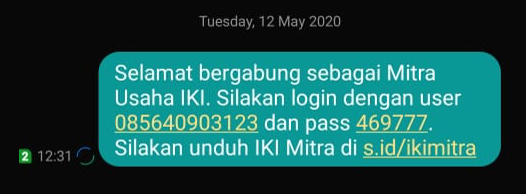
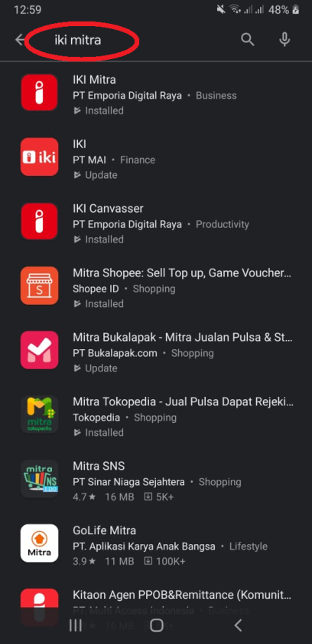
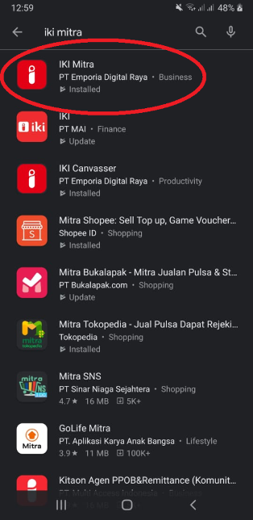
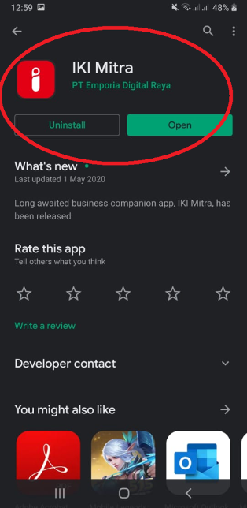
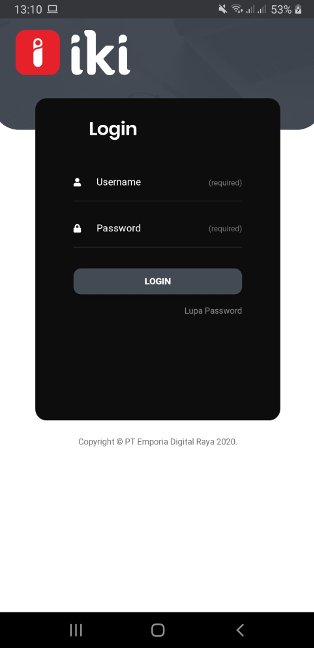
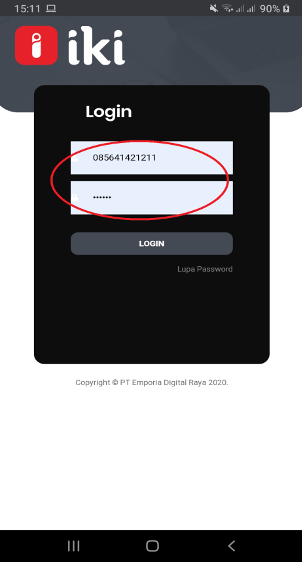
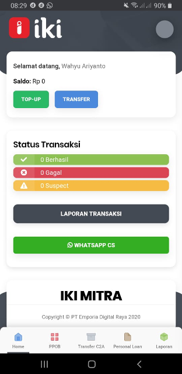

## Download Aplikasi IKI Mitra

Setelah ada kunjungan Area Leader untuk Akuisisi Mitra Usaha dan pendaftaran disetujui, pihak Mitra usaha akan mendapatkan konfirmasi SMS ke No Handphone Mitra Usaha yang berisi bahwa sudah di setujui menjadi Mitra Usaha dengan username (No HP), password  (6 digit) untuk login ke Aplikasi Mitra Usaha.

Contoh SMS yang diterima Mitra Usaha sebagai berikut

Cari aplikasi IKI Mitra di PlayStore atau klik [disini](https://s.id/ikimitra)

Pilih IKI Mitra - PT Emporia Digital Raya

Tekan Install untuk download Aplikasi IKI Mitra

## Login di Aplikasi IKI Mitra

Setelah IKI Mitra terinstall, buka aplikasi IKI Mitra

Masukan Username dan password yang di dapatkan dari IKI yang di kirim lewat SMS ke No HP Mitra Usaha

Berhasil masuk ke aplikasi IKI Mitra

