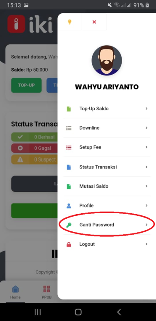
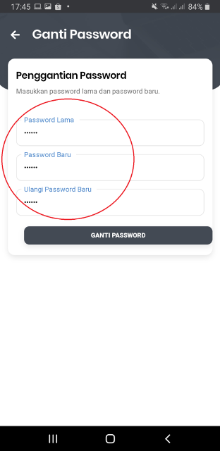
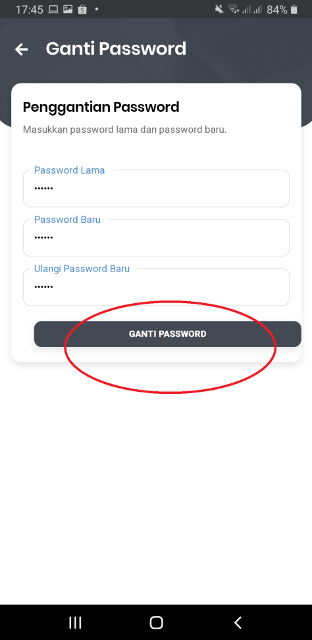

## Buka Aplikasi IKI Mitra

## Tekan gambar Profile

## Tekan Ganti Password

## Tuliskan Password Lama , Password baru dan Ulangi Password Baru

## Tekan Ganti Password 

## Ganti password IKI Mitra berhasil

