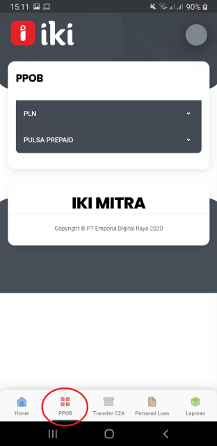

### Buka Aplikasi IKI Mitra

### Tekan Menu PPOB di IKI Mitra

### Tekan PLN akan muncul pilihan pembayaran  PLN

### Contoh Pembelian PLN Prepaid, kita tekan PLN Prepaid

### Masukan No Meter Listrik  Pelanggan

### Tekan INQUIRY
Akan kelihatan data No Meter  Nama Pelanggan dan Daya Listrik Pelanggan

### Pilih Nominal Denom 

### Akan kelihatan Nominal Denom dan Total Bayar.
Kemudian tekan Bayar akan muncul notifikasi  “Lakukan Pembayaran“ Kita tekan Ya

### Pembelian PLN Prepaid Berhasil
 

### Untuk Struk bisa kita kirimkan lewat email 
Rincian Perhitungan sebagai Berikut 
Total Biaya Admin yang dibayar oleh pelanggan Rp 2,750 pembagian Fee sebagai berikut
- Keuntungan Mitra Usaha Rp 2,250
- Biaya Layanan PLN  Rp 500

### Tuliskan alamat email,  kemudian tekan kirim.

### Pembelian PLN Prepaid Berhasil

