### Buka Aplikasi IKI Mitra

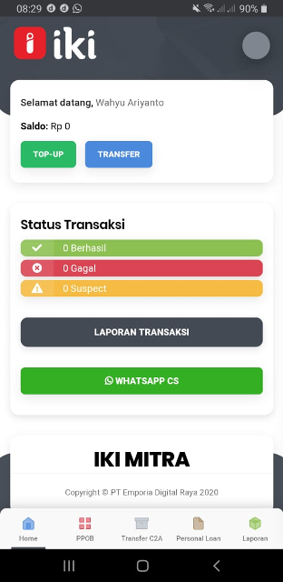

### Tekan Menu PPOB di IKI Mitra

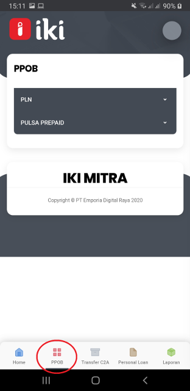

### Tekan PULSA PREPAID akan muncul pilihan provider

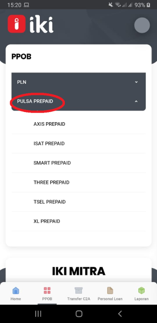

### Contoh pembelian Pulsa XL Prepaid, kita tekan XL Prepaid

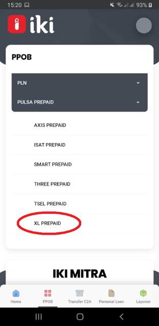

### Kita tekan “ Pilih Salah Satu “ Untuk pilihan pembelian nominal pulsa

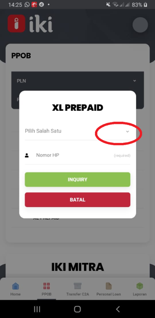

### Kita pilih sesuai nominal pembelian pulsa

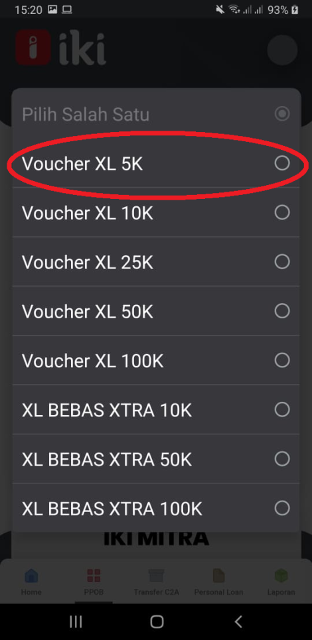

### Kemudian kita masukan No Hand Phone pelanggan 

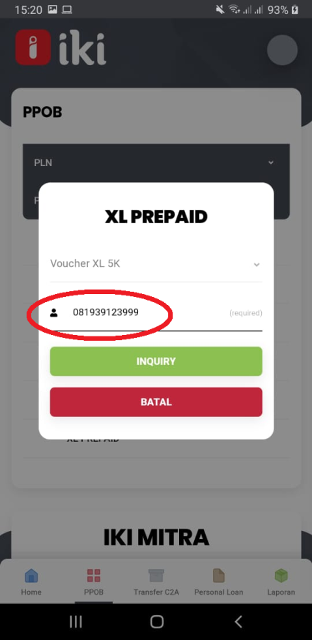

### Tekan INQUIRY akan muncul Harga Pulsa Prepaid tersebut
- Harga tersebut adalah harga modal Mitra Usaha
- Misalnya harga Pulsa XL Rp 5,000 harga Modal Rp 6,625
- Untuk Harga Jual misalnya Rp 7,000 jadi keuntungan Mitra Usaha Rp 375

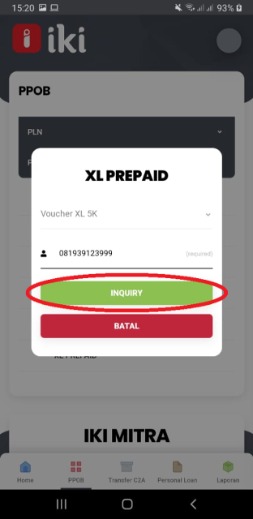

### Kemudian tekan Bayar akan muncul notifikasi “Lakukan Pembayaran“ Kita tekan Ya

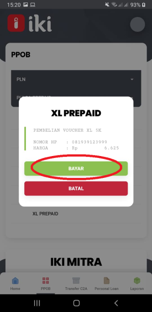

### Pembelian Pulsa Prepaid berhasil

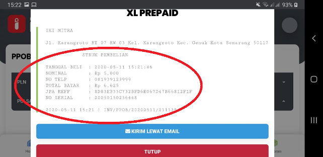

### Untuk Struk bisa kita kirimkan lewat email

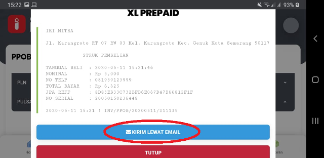

### Tuliskan alamat email kemudian tekan kirim

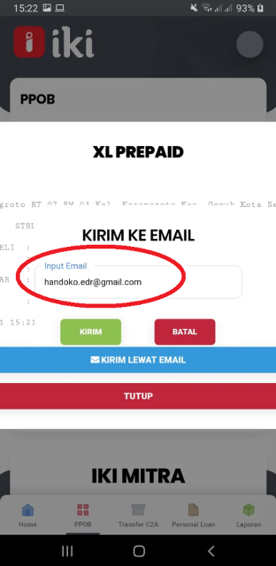

### Pembelian pulsa berhasil dan bisa di cek di HP Pelanggan Pulsa sudah masuk
 
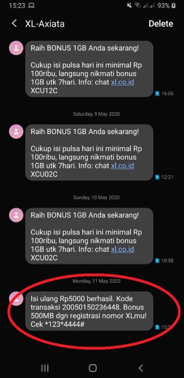

