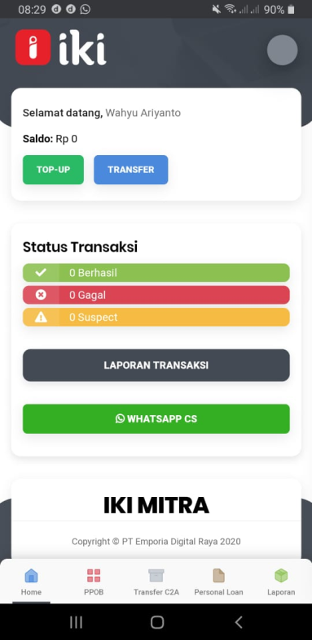
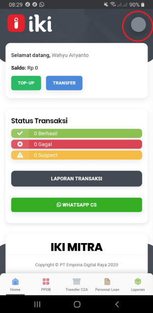
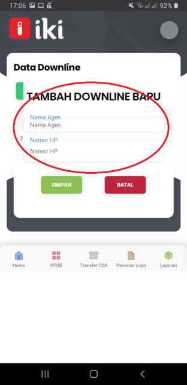
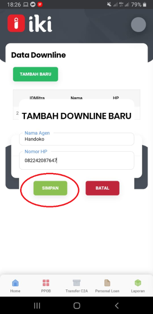
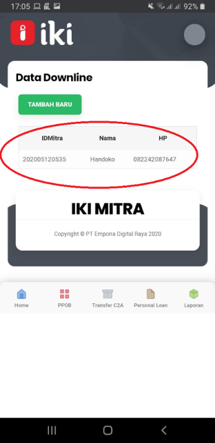

## Buka Aplikasi IKI Mitra



## Tekan gambar Profile



## Tekan Downline, masukkan nama dan No HP Downline



## Tekan Simpan 



## Penambahan Downline berhasil



## Downline akan mendapatkan SMS dari IKI yang berisi Username (No HP) dan Password (6 Digit) 

Contoh SMS sebagai berikut 

```Selamat bergabung sebagai Mitra Usaha IKI. Silakan login dengan user 081234567890 dan pass 123456. Silakan unduh IKI Mitra di s.id/ikimitra```

<script>
    setTimeout(()=>{
        let list = ['fixedHeaderContainer'];
        for (var itemClassName of list) {
            var item = document.getElementsByClassName(itemClassName)[0]
            item.parentNode.removeChild(item)
        }
        document.getElementsByClassName('navPusher')[0].style.paddingTop = 0;
    }, 0)
</script>