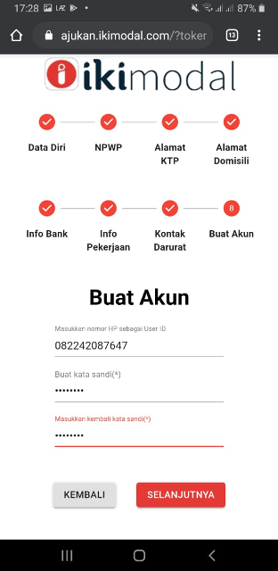

### Buka Aplikasi IKI Mitra 

### Tekan Menu Personal Loan di IKI Mitra

### Tekan Gambar + untuk mengisi Form Pinjaman

#### Form Pinjaman akan terlihat
- Foto KTP dan Foto Selfie Peminjam dengan KTP , kemudian tekan Selanjutnya

  
- Isikan Data Peminjam 
  - Nama Lengkap 
  - No Handphone
  - Email kemudian tekan selanjutnya.

  
- Isikan data Pinjaman 
  - Tujuan Penggunaan
  - Jumlah Pinjaman 
  - Jangka waktu
  - Frekuensi Pinjaman
  - Hubungan dengan Peminjam
  - Komentar, kemudian  tekan selanjutnya

  

- Konfirmasi Pengajuan, kemudian tekan selanjutnya

  

#### Proses Pengajuan Pinjaman berhasil di proses 
Silakan cek Handphone Peminjam akan mendapat SMS dari IKI untuk proses selanjutnya

### Setelah mendapatkan SMS dari IKI ( CITI Call ) seperti di bawah ini silahkan di buka Link konfirmasinya

#### Form  Pengisian pinjaman 
- Isikan Data Diri , kemudian tekan selanjutnya

  
- Data NPWP apabila ada , kemudian tekan selanjutnya

  
- Data Alamat KTP,  kemudian tekan selanjutnya

  
- Data Alamat Domisili , kemudian tekan selanjutnya

  
- Data Info Bank , kemudian tekan selanjutnya

  
- Data Info Pekerjaan , kemudian tekan selanjutnya

  
- Data Kontak Darurat kemudian tekan selanjutnya

  
- Buat Akun,  kemudian tekan selanjutnya

  
#### Pembuatan Akun Berhasil

### Langkah selanjutnya hubungi Kontak darurat untuk mengecek SMS dari IKI ( CITI Call )mengenai konfirmasi

### Setelah mendapatkan SMS dari IKI ( CITI Call ) seperti di bawah ini silahkan di buka Link konfirmasinya

#### Pengisian Persetujuan Kontak Darurat Kemudian Kirim

#### Persetujuan Kontak Darurat telah di setujui dan proses Pengajuan Pinjaman sudah selesai

### Estimasi Proses pengajuan sampai dana cair kurang lebih 5 hari.

