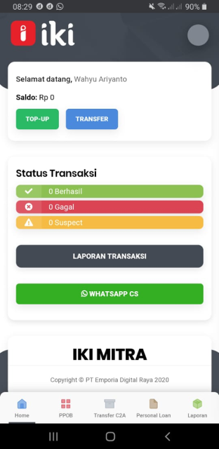
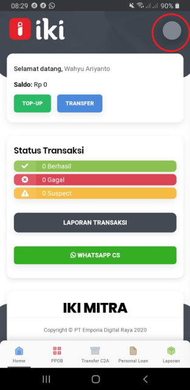
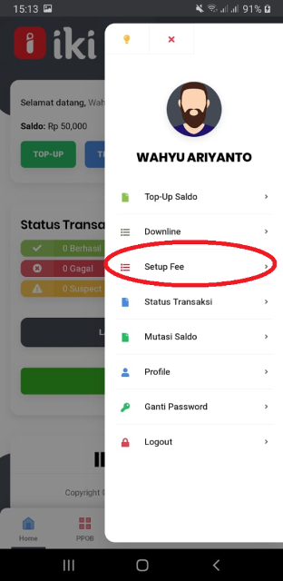
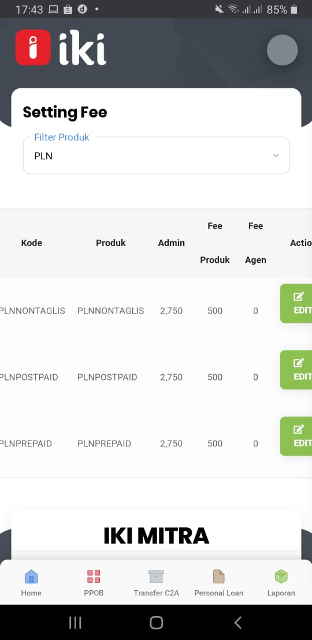
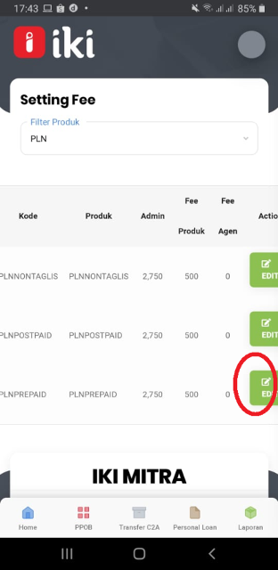
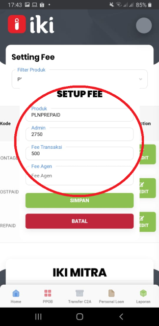
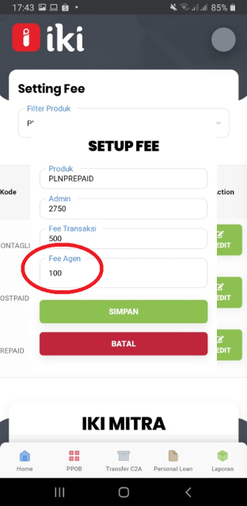
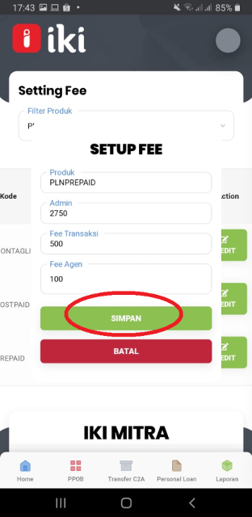
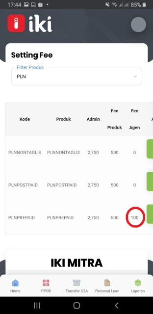

### Buka Aplikasi IKI Mitra

### Tekan gambar Profile

### Tekan Setup Fee

### Masuk ke Setting Fee, ada Filter  produk PLN dan Pulsa

### Tekan Edit 

### Akan terlihat produk Setup Fee

### Masukkan nominal di kolom Fee Agen

### Kemudian tekan Simpan

### Setup Fee berhasil

