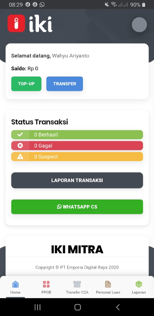
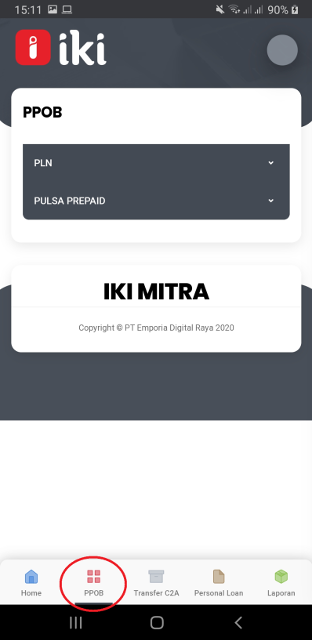
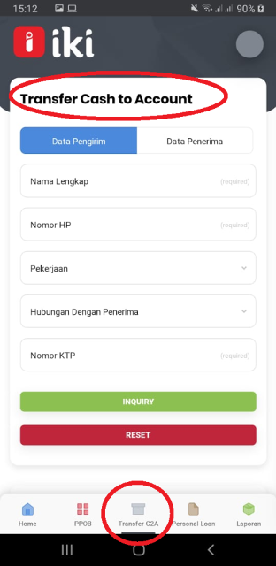
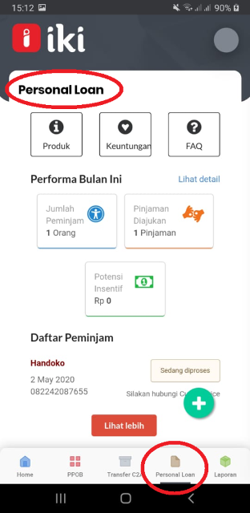
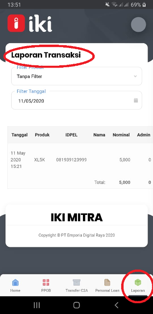
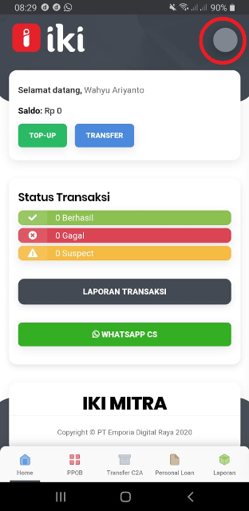
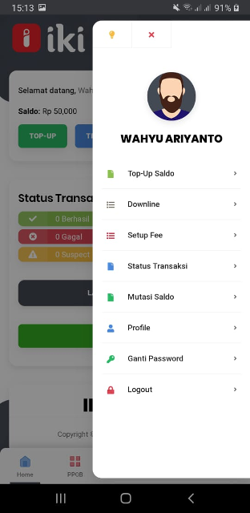

## Menu Home IKI Mitra untuk Mitra Usaha

## Menu PPOB di IKI Mitra
Untuk saat ini ada ada 2 produk PPOB yang tersedia di IKI Mitra, yaitu:
1.	PLN yaitu  pembayaran
    - PLNPOSTPAID (Tagihan Bulanan)
    - PLNPREPAID (Token)
    - PLNNONTAGLIS (Non Tagihan Listrik misalnya Penambahan Daya)

2.	PULSA PREPAID yaitu pembelian Pulsa
    - AXIS
    - INDOSAT
    - SMART
    - THREE
    - TELKOMSEL
    - XL

## Menu Cash To Account (Transfer Bank Dalam Negeri)
Transfer C2A ( Cash To Account )  adalah Fasilitas Layanan Pengiriman Uang secara Tunai  ke Rekening Bank Lain secara Realtime.

## Menu Personal Loan
Personal Loan adalah Fasilitas Layanan Pinjaman  Uang  Tunai yang diperuntukkan untuk Mitra Usaha dan Personal

## Menu Laporan 
Menu untuk melihat Status Transaksi dari Mitra Usaha

## Menu Profil

Akan Muncul menu Profil Berikut

- Top Up Saldo berfungsi untuk Top Up Saldo Mitra Usaha
- Downline berfungsi Melihat dan Menambahkan downline/ agen Mitra Usaha
- Setup Fee berfungsi Melakukan pengaturan terhadap harga produk yang akan di jual oleh donwline / agen
- Status Transaksi berfungsi untuk melihat Status Transaksi dari Mitra Usaha
- Mutasi Saldo berfungsi untuk melihat mutasi saldo IKI Mitra
- Profile berfungsi tampilan  pengguna atau Profile Mitra yang telah di daftarkan Oleh Area Leader.
- Ganti Password berfungsi untuk Mengubah Password Log in yg lama dengan yang Baru
- Logout berfungsi untuk keluar dari user Mitra Usaha

