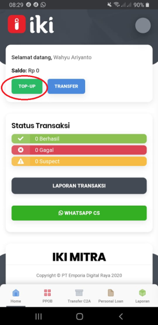
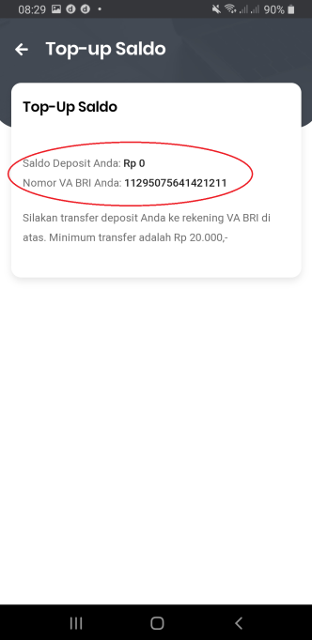
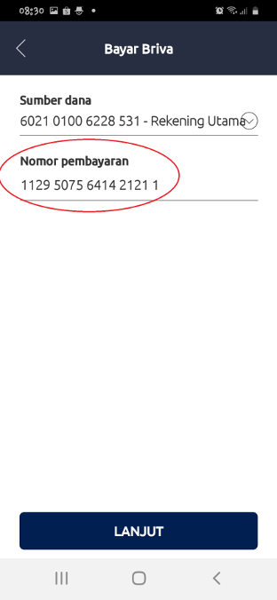
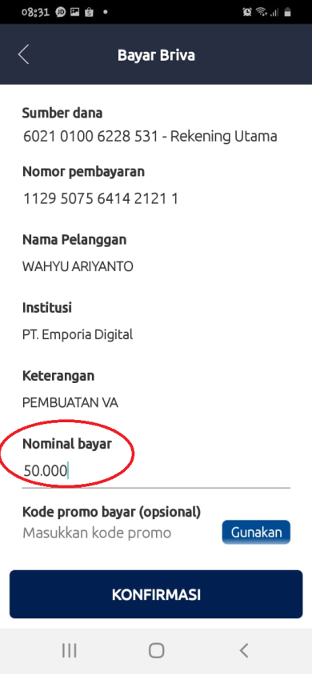
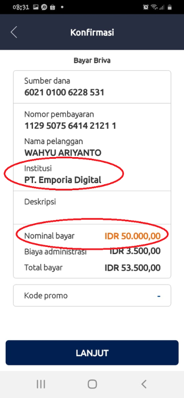
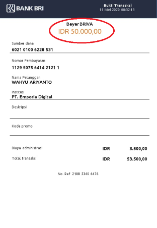
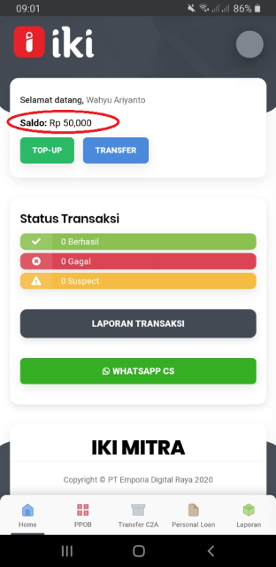

### Buka Aplikasi IKI Mitra, kemudian tekan menu Top Up

### Akan muncul No Virtual Account , harap di catat dan disimpan untuk rekening tujuan pada saat transfer menggunakan Mobile Banking,  Internet Banking , ATM, dan Lainnya

### Masukan No Virtual Account ke No Tujuan pada saat transaksi transfer, kemudian tekan lanjut 

### Masukan nominal Top Up kemudian tekan konfirmasi

### Cek Nama penerima PT Emporia Digital dan Nominal Top Up

### Berhasil transfer ke Rekening Virtual Account BRI

### Cek Saldo IKI di aplikasi IKI Mitra

