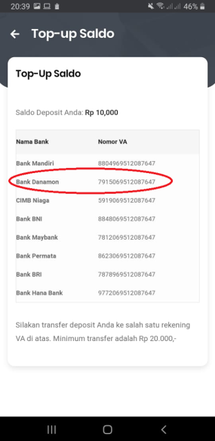

## Top Up Menggunakan Rekening Bank Mandiri 
Berikut langkah-langkah Panduan Top Up Rekening (Virtual Account) Bank Mandiri  Mitra Usaha di Aplikasi IKI Mitra menggunakan Rekening Bank Mandiri:

### Buka Aplikasi IKI Mitra, kemudian tekan Menu Top Up

### Akan muncul No Rekening (Virtual Account) Top Up Bank Mandiri Mitra Usaha
Harap dicatat dan disimpan untuk rekening tujuan pada saat melakukan transaksi menggunakan Mobile Banking,  Internet Banking , ATM dan Lainnya

#### Melalui Transfer ATM Bank Mandiri 
1.	Silahkan pilih menu “Bayar/Beli”
2.	Selanjutnya akan muncul tipe pembayaran pilih “Multi Payment”
3.	Silahkan masukkan kode perusahaan Nicepay “88049” lalu pilih “Benar”
4.	Masukkan nomor Rekening ( Virtual Account ) Top Up Bank Mandiri Mitra Usaha (contoh: 8804969511421123) dan Tekan “Benar”
5.	Isikan nominal yang akan dibayarkan, kemudian tekan “Benar”
6.	Jangan lupa untuk memeriksa informasi yang tertera pada layar. Pastikan semua informasi dan total tagihan yang ditampilkan sudah benar. Jika benar, tekan angka 1 dan pilih “Ya”
7.	Periksa layar konfirmasi dan pilih “Ya” untuk melakukan pembayaran
8.	Bukti pembayaran dalam bentuk struk agar disimpan sebagai bukti pembayaran yang sah dari Bank Mandiri
9.	Transaksi Anda telah selesai

#### Melalui Mobile Banking Bank Mandiri 
1.	Silahkan login ke mobile banking Anda.
2.	Klik “Menu” di sebelah kiri atas.
3.	Pilih menu “Pembayaran”
4.	Pilih buat “Pembayaran Baru”
5.	Pilih “Multi Payment”
6.	Klik “Penyedia Jasa” kemudian pilih kode perusahaan, Nicepay ”88049”
7.	Pilih “No. Virtual”
8.	Masukkan nomor rekening ( Virtual Account ) Top Up Bank Mandiri Mitra Usaha dengan kode perusahaan (Contoh : 8804969511421123), kemudian pilih “Tambah Sebagai Nomor Baru”
9.	Masukkan nominal lalu pilih “Konfirmasi” dan “lanjut”
10.	Selanjutnya akan muncul tampilan konfirmasi pembayaran. Pastikan  semua informasi dan total tagihan sudah benar. Jika sudah benar, lalu scroll ke bawah  dan pilih “Konfirmasi”
11.	Masukkan PIN Anda dan pilih “OK”
12.	Transaksi berhasil
Melalui Internet Banking Bank Mandiri 
1.	Login ke website Mandiri Online dengan memasukkan user ID dan PIN
2.	Pilih menu “Pembayaran”
3.	Pilih menu “Multi Payment”
4.	Silahkan pilih “No Rekening Anda”
5.	Pilih “Penyedia Jasa”, Nicepay 88049”
6.	Pilih “No Virtual Account”
7.	Masukkan “Nomor Rekening ( Virtual Account )Top Up Bank Mandiri Mitra Usaha ( contoh  : 8804969511421123)
8.	Masuk ke halaman konfirmasi 1
9.	Apabila sudah sesuai, klik “Tagihan Total”, kemudian “Lanjutkan”
10.	Masuk ke halaman konfirmasi 2
11.	Masukkan Challenge Code yang dikirimkan ke Token Internet Banking Anda, kemudian “Kirim”
12.	Anda akan masuk ke halaman konfirmasi jika pembayaran telah selesai

### Transaksi Top Up Berhasil dan Cek Saldo di Aplikasi IKI Mitra

## Top Up Menggunakan Rekening Bank Danamon
Berikut langkah-langkah Panduan Top Up Rekening (Virtual Account) Bank Danamon Mitra Usaha di Aplikasi IKI Mitra menggunakan Rekening Bank Danamon:

### Buka Aplikasi IKI Mitra, kemudian tekan Menu Top Up

### Akan muncul No Rekening ( Virtual Account ) Top Up Bank Danamon Mitra Usaha
Harap di catat dan disimpan untuk rekening tujuan pada saat melakukan transaksi menggunakan D Mobile Banking,  ATM dan Lainnya

#### Melalui Transfer ATM Bank Danamon
1.	Masukan  PIN ATM Anda
2.	Pilih Menu “Pembayaran” >>> Virtual Account
3.	Masukan nomor  “ Rekening ( Virtual Account ) Top Up Danamon Mitra Usaha” (Contoh: 7915069512087123)
4.	Masukkan Nominal
5.	Pada layar konfirmasi pembayaran, pastikan transaksi sudah benar -> pilih “Ya“untuk memproses transaksi

#### Melalui D Mobile Bank Danamon
1.	Login pada Aplikasi D-Mobile
2.	Pilih menu “Virtual Account”
3.	Masukan 16 digit nomor” Rekening ( Virtual Account ) Top Up Danamon Mitra Usaha” (Contoh :7915069512087123)
4.	Masukan Nominal
5.	Pada layar konfirmasi pembayaran, pastikan transaksi sudah benar -> pilih” Ya” untuk memproses transaksi.

### Transaksi Top Up Berhasil dan Cek Saldo di Aplikasi IKI Mitra

## Top Up Menggunakan Rekening Bank CIMB NIAGA
Berikut langkah- langkah Panduan Top Up Rekening (Virtual Account) Bank CIMB NIAGA  Mitra Usaha di Aplikasi IKI Mitra menggunakan Rekening Bank CIMB NIAGA:

### Buka Aplikasi IKI Mitra, kemudian tekan Menu Top Up

### Akan muncul No Rekening ( Virtual Account ) Top Up Bank CIMB NIAGA  Mitra Usaha
Harap di catat dan disimpan untuk rekening tujuan pada saat melakukan transaksi menggunakan Mobile Banking,  Internet Banking , ATM dan Lainnya

#### Melalui Transfer ATM Bank CIMB NIAGA
1.	Masukan kartu ATM dan PIN Anda
2.	Pilih Menu “ Pembayaran”
3.	Pilih Menu “Lanjut”
4.	Pilih Menu “Virtual Account”
5.	Masukkan “ Nomor Rekening ( Virtual Account ) Top Up CIMB NIAGA Mitra Usaha” , (contoh:5919069512087123)”
6.	Pilih “Proses”
7.	Data Virtual Account akan ditampilkan
8.	Pilih “Proses”
9.	Ambil bukti bayar anda
10.	Selesai

#### Melalui Mobile Banking Bank CIMB NIAGA
1.	Login “Go Mobile”
2.	Pilih Menu “Transfer”
3.	Pilih Menu “ Transfer ke CIMB Niaga Lain”
4.	Pilih Sumber Dana yang akan digunakan
5.	Masukkan Nomor Rekening ( Virtual Account ) Top Up Mitra Usaha ( Contoh: 5919069512087123)
6.	Masukkan “Nominal”
7.	Klik “Lanjut”
8.	Data “Nomor Rekening Top Up Mitra Usaha” akan ditampilkan
9.	Masukkan “PIN Mobile”
10.	Klik “Konfirmasi”
11.	Bukti bayar akan dikirim melalui sms
12.	Selesai

#### Melalui Internet Banking Bank CIMB NIAGA
1.	Login “ Internet Banking”
2.	Pilih “Bayar Tagihan”
3.	Rekening Sumber –  Pilih yang akan Anda digunakan
4.	Jenis Pembayaran –  Pilih “Virtual Account”
5.	Untuk Pembayaran - Pilih “Masukkan Nomor Rekening ( Virtual Account ) Top Up Mitra Usaha”
6.	Nomor Rekening Top Mitra Usaha , (contoh: 5919069512087123)
7.	Isi Remark Jika diperlukan
8.	Klik “Lanjut”
9.	Data “Nomor Rekening( Virtual Account )  Top Up Mitra Usaha” akan ditampilkan
10.	Masukkan “mPIN”
11.	Klik “Kirim”
12.	Bukti bayar akan ditampilkan
13.	Selesai

### Transaksi Top Up Berhasil dan Cek Saldo di Aplikasi IKI Mitra

## Top Up Menggunakan Rekening Bank BNI

Berikut langkah- langkah Panduan Top Up Rekening (Virtual Account) Bank BNI  Mitra Usaha di Aplikasi IKI Mitra menggunakan Rekening Bank BNI:

### Buka Aplikasi IKI Mitra, kemudian tekan Menu Top Up

### Akan muncul No Rekening (Virtual Account) Top Up Bank BNI Mitra Usaha
Harap di catat dan disimpan untuk rekening tujuan pada saat melakukan transaksi menggunakan Mobile Banking,  Internet Banking , ATM , SMS Banking dan Lainnya

#### Melalui Transfer ATM Bank BNI
1.	Masukkan “Kartu Anda”
2.	Pilih “Bahasa”
3.	Masukkan “PIN ATM Anda”
4.	Pilih "Menu Lainnya"
5.	Pilih "Transfer"
6.	Pilih Jenis rekening yang akan Anda gunakan (Contoh; "Dari Rekening Tabungan")
7.	Pilih “Virtual Account Billing”
8.	Masukkan “Nomor Rekening ( Virtual Account ) Top Up Bank BNI Mitra Usaha (Contoh :8848069512087123)
9.	Tagihan yang harus dibayarkan akan muncul pada layar konfirmasi
10.	Konfirmasi, apabila telah sesuai, lanjutkan transaksi
11.	Transaksi Anda telah selesai

#### Melalui Mobile Banking Bank BNI
1.	Akses” BNI Mobile Banking” dari handphone kemudian masukkan user ID dan password
2.	Pilih menu “Transfer”
3.	Pilih menu “Virtual Account Billing” kemudian pilih rekening debet
4.	Masukkan Nomor Rekening ( Virtual Account) Top Up Bank BNI Mitra Usaha (contoh: 8848069512087123 )  pada menu “input baru”
5.	Tagihan yang harus dibayarkan akan muncul pada layar konfirmasi
6.	Konfirmasi transaksi dan masukkan Password Transaksi
7.	Pembayaran Anda Telah Berhasil

#### Melalui Internet Banking Bank BNI (iBank Personal BNI)
1.	Ketik alamat https://ibank.bni.co.id kemudian klik “Enter”
2.	Masukkan” User ID dan Password”
3.	Pilih menu “Transfer”
4.	Pilih “Virtual Account Billing”
5.	Kemudian masukan Nomor Rekening (Virtual Account) Top Up Bank BNI Mitra Usaha (contoh: 8848069512087123) yang hendak dibayarkan. Lalu pilih rekening debet yang akan digunakan. Kemudian tekan ‘’lanjut’’
6.	Kemudin tagihan yang harus dibayarkan akan muncul pada layar konfirmasi
7.	Masukkan Kode Otentikasi Token
8.	Pembayaran Anda telah berhasil

#### Melalui SMS Banking Bank BNI
1.	Buka aplikasi “SMS Banking BNI”
2.	Pilih menu” Transfer”
3.	Pilih menu Transfer “rekening BNI”
4.	Masukkan Nomor rekening ( Virtual Account ) Top Up Bank BNI Mitra Usaha tujuan dengan 16 digit ( Contoh 8848069512087123)
5.	Masukkan Nominal transfer sesuai tagihan atau kewajiban Anda. Nominal yang berbeda tidak dapat diproses
6.	Pilih “Proses” kemudian “Setuju”
7.	Reply sms dengan ketik pin sesuai perintah
8.	Transaksi Berhasil

### Transaksi Top Up Berhasil dan Cek Saldo di Aplikasi IKI Mitra

## Top Up Menggunakan Rekening Bank Maybank
Berikut langkah- langkah Panduan Top Up Rekening ( Virtual Account ) Bank Maybank Mitra Usaha di Aplikasi IKI Mitra menggunakan Rekening Bank Maybank  sebagai berikut :

### Buka Aplikasi IKI Mitra, kemudian tekan Menu Top Up

### Akan muncul No Rekening ( Virtual Account ) Top Up Bank Maybank Mitra Usaha
Harap di catat dan disimpan untuk rekening tujuan pada saat melakukan transaksi menggunakan Mobile Banking,  Internet Banking , ATM , SMS Banking dan Lainnya

#### Melalui Transfer ATM Bank Maybank
1.	Masukan  “kartu ATM dan PIN Anda”
2.	Pilih “ Menu Pembayaran”
3.	Pilih Virtual Account
4.	Masukan Nomor Rekening ( Virtual Account) Top Up Bank Maybank Mitra Usaha ( Contoh : 7812069512087123)
5.	Pilih “Benar”
6.	Pilih “Ya”
7.	Ambil bukti bayar Anda
8.	Selesai

#### Melalui Mobile Banking Bank Maybank
1.	Login “Internet Banking”
2.	Pilih “Rekening dan Transaksi”
3.	Pilih “Maybank Virtual Account”
4.	Pilih “Sumber Tabungan”
5.	Input Nomor  Rekening ( Virtual Account ) Top Up Bank Maybank Mitra Usaha ( Contoh : 7812069512087123)
6.	Masukan ” Nominal”
7.	Klik “Submit”
8.	Masukan”SMS Token”
9.	Bukti bayar ditampilkan
10.	Selesai

#### Melalui SMS Banking Bank Maybank
1.	SMS ke “69811”
2.	Ketik “TRANSFER <Nomor Rekening (Virtual Account) Top Up Bank Maybank Mitra Usaha  > <Nominal>”
3.	Contoh: “TRANSFER 7812069512087123 20000”
4.	Kirim “SMS”
Anda akan mendapat balasan Transfer dari rek < nomor rekening anda > ke rek < Nomor Rekening ( Virtual Account ) Top Up Bank Maybank Mitra Usaha > sebesar Rp. 20.000 Ketik < karakter acak >
5.	Balas “SMS tersebut,  ketik < karakter acak >”
6.	Kirim” SMS”
7.	Selesai

### Transaksi Top Up Berhasil dan Cek Saldo di Aplikasi IKI Mitra

## Top Up Menggunakan Rekening Bank Permata
Berikut langkah-langkah Panduan Top Up Rekening ( Virtual Account ) Bank Permata  Mitra Usaha di Aplikasi IKI Mitra menggunakan Rekening Bank Permata:

### Buka Aplikasi IKI Mitra, kemudian tekan Menu Top Up

### Akan muncul No Rekening ( Virtual Account ) Top Up Bank Permata Mitra Usaha
Harap di catat dan disimpan untuk rekening tujuan pada saat melakukan transaksi menggunakan Mobile Banking,  Internet Banking , ATM , SMS Banking dan Lainnya

##### Melalui Transfer ATM Bank Permata
1.	Masukan “kartu ATM dan PIN Anda”
2.	Pilih “Menu Transaksi Lainnya”
3.	Pilih “Pembayaran”
4.	Pilih “Pembayaran Lain-lain”
5.	Pilih Virtual Account
6.	Masukan “Nomor Rekening ( Virtual Account) Top Up Bank Permata Mitra Usaha  ( Contoh  8623069512087123)
7.	Select “Benar”
8.	Select “Ya”
9.	Ambil bukti bayar anda
10.	Selesai

##### Melalui Mobile Banking Bank Permata
1.	Login “Mobile Banking”
2.	Pilih “Pembayaran Tagihan”
3.	Pilih “Virtual Account”
4.	Masukan “Nomor Rekening( Virtual Account)  Top Up Bank Permata Mitra Usaha ( Contoh : 8623069512087123 )
5.	Masukan “Nominal” 
6.	Pilih “Kirim”
7.	Masukan “Token”
8.	Pilih  “Kirim”
9.	Bukti bayar akan ditampilkan
10.	Selesai

#### Melalui Internet Banking Bank Permata
1.	Login “Internet Banking”
2.	Pilih “Pembayaran Tagihan”
3.	Pilih “Virtual Account”
4.	Masukan “Nomor Rekening( Virtual Account)  Top Up Bank Permata Mitra Usaha ( Contoh : 8623069512087123 )
5.	Masukan “Nominal” 
6.	Pilih “Kirim”
7.	Masukan “Token”
8.	Pilih  “Kirim”
9.	Bukti bayar akan ditampilkan
10.	Selesai

### Transaksi Top Up Berhasil dan Cek Saldo di Aplikasi IKI Mitra

## Top Up Menggunakan Rekening Bank BRI
Berikut langkah- langkah Panduan Top Up Rekening ( Virtual Account ) Bank BRI  Mitra Usaha di Aplikasi IKI Mitra menggunakan Rekening Bank BRI:

### Buka Aplikasi IKI Mitra, kemudian tekan Menu Top Up

### Akan muncul No Rekening (Virtual Account) Top Up Bank BRI Mitra Usaha
Harap dicatat dan disimpan untuk rekening tujuan pada saat melakukan transaksi menggunakan Mobile Banking,  Internet Banking , ATM , SMS Banking dan Lainnya

#### Melalui Transfer ATM Bank BRI
1.	Masukan “kartu ATM dan PIN Anda”
2.	Pilih “Menu Transaksi Lain”
3.	Pilih “Menu Pembayaran”
4.	Pilih “Menu Lain-lain”
5.	Pilih “Menu BRIVA”
6.	Masukkan “Nomor  Rekening (Virtual Account) Top Up Bank BRI Mitra Usaha ( Contoh 7878069512087123)
7.	Pilih “ Ya”
8.	Ambil bukti bayar anda
9.	Selesai

#### Melalui Mobile Banking Bank BRI
1.	Login “Mobile Banking BRI”
2.	Pilih “Menu Pembayaran”
3.	Pilih “Menu BRIVA”
4.	Masukkan “Nomor  Rekening (Virtual Account) Top Up Bank BRI Mitra Usaha ( Contoh : 7878069512087123)
5.	Masukkan “Nominal” 
6.	Pilih” Kirim”
7.	Masukkan “PIN Mobile”
8.	Klik “Kirim”
9.	Bukti bayar akan dikirim melalui sms
10.	Selesai

#### Melalui Internet Banking Bank BRI
1.	Login  “Mobile Banking BRI”
2.	Pilih “Menu Pembayaran”
3.	Pilih “Menu BRIVA”
4.	Masukkan “Nomor  Rekening (Virtual Account) Top Up Bank BRI Mitra Usaha ( Contoh : 7878069512087123)
5.	Masukkan “Nominal” 
6.	Pilih” Kirim”
7.	Masukkan “mToken”
8.	Klik “Kirim”
9.	Bukti bayar akan dikirim melalui sms
10.	Selesai

C.	Transaksi Top Up Berhasil dan Cek Saldo di Aplikasi IKI Mitra

## Top Up Menggunakan Rekening Hana Bank
Berikut langkah- langkah Panduan Top Up Rekening ( Virtual Account ) Hana Bank  Mitra Usaha di Aplikasi IKI Mitra menggunakan Rekening Hana Bank sebagai berikut :

### Buka Aplikasi IKI Mitra, kemudian tekan Menu Top Up

### Akan muncul No Rekening (Virtual Account) Top Up Hana Bank Mitra Usaha
Harap di catat dan disimpan untuk rekening tujuan pada saat melakukan transaksi menggunakan Internet Banking, ATM dan Lainnya

#### Melalui Transfer ATM Hana Bank 
1.	Masukan “kartu ATM dan PIN Anda”
2.	Pilih “Menu Pembayaran”
3.	Pilih “Lainnya”
4.	Masukan “ Nomor Rekening ( Virtual Account) Top Up Hana Bank Mitra Usaha ( Contoh : 9772069512087123)
5.	Pilih” Benar”
6.	Pilih “Ya”
7.	Ambil bukti bayar Anda
8.	Selesai

#### Melalui Internet Banking Hana Bank 
1.	Login” Internet Banking”
2.	Pilih” menu Transfer “kemudian Pilih “ Withdrawal Account Information”
3.	Pilih “Account Number” 
4.	Masukan “ Nomor Rekening ( Virtual Account ) Top Up Hana Bank Mitra Usaha ( Contoh: 9772069512087123)
5.	Masukan  “Nominal”
6.	Pilih “ Submit”
7.	Masukan “ SMS PIN”
8.	Bukti bayar akan ditampilkan
9.	Selesai

### Transaksi Top Up Berhasil dan Cek Saldo di Aplikasi IKI Mitra

## Top Up Menggunakan Rekening ATM Bersama/ Alto/ Prima
Berikut langkah- langkah Panduan Top Up Rekening (Virtual Account) Bank BNI  Mitra Usaha di Aplikasi IKI Mitra menggunakan ATM Bersama:

### Buka Aplikasi IKI Mitra, kemudian tekan Menu Top Up

### Akan muncul No Rekening ( Virtual Account ) Top Up Bank BNI Mitra Usaha
Harap dicatat dan disimpan untuk rekening tujuan pada saat melakukan transaksi menggunakan Mobile Banking,  Internet Banking, ATM Bersama/ Alto/ Prima

#### Melalui Transfer ATM Bersama
1.	Masukkan “kartu ke mesin ATM Bersama”
2.	Pilih "Transaksi Lainnya".
3.	Pilih menu "Transfer".
4.	Pilih "Transfer ke Bank Lain".
5.	Masukkan” kode bank BNI (009) dan  Nomor  Rekening (Virtual Account ) Top Up Bank BNI  Mitra Usaha ( Contoh:  8848069510287123)
6.	Masukkan “Nominal”
7.	Konfirmasi “ Rincian”
8.	Tekan “Ya”
9.	Transaksi Berhasil.

#### Melalui Mobile / Internet Banking ATM Bersama
1.	Login “Mobile / Internet banking”
2.	Pilih “Transfer ke Bank Lain “ 
3.	Pilih “Bank BNI atau masukan kode Bank BNI ( 009)” 
4.	Masukkan” kode bank BNI (009) dan  Nomor  Rekening (Virtual Account ) Top Up Bank BNI  Mitra Usaha ( Contoh: 8848069510287123)
5.	Masukan “Nominal”
6.	Ikuti instruksi untuk menyelesaikan transaksi Anda

### Transaksi Top Up Berhasil dan Cek Saldo di Aplikasi IKI Mitra

