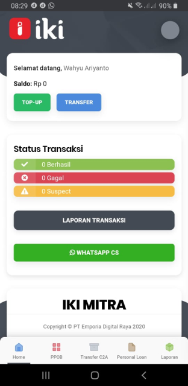
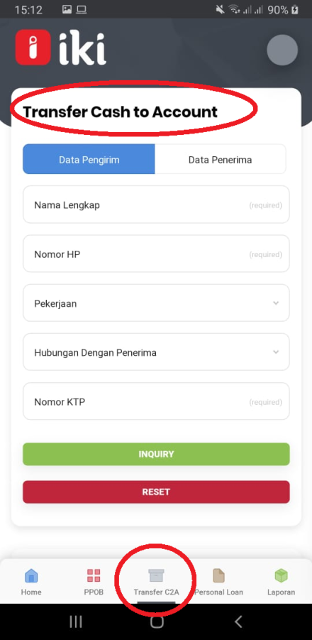
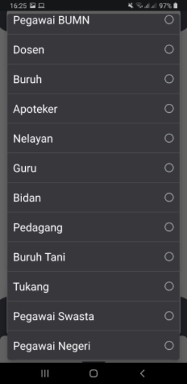
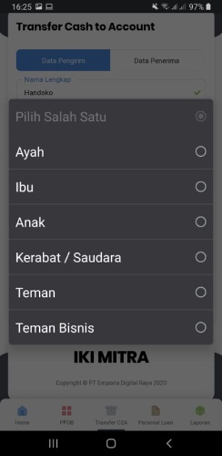
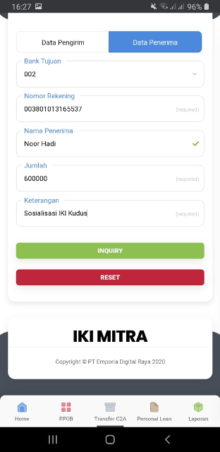
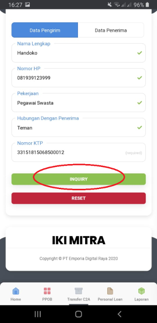
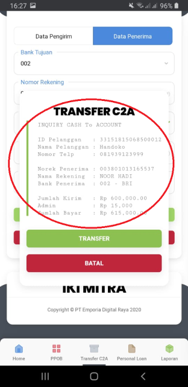
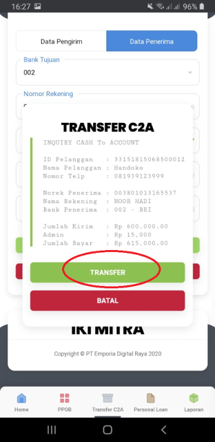

### Buka Aplikasi IKI Mitra 

### Tekan Menu Transfer C2A  di Aplikasi IKI Mitra

### Isikan data Pengirim

- Nama Lengkap
- Nomor HP
- Pekerjaan di pilih

    
- Hubungan dengan penerima di pilih

    
- Nomor KTP

### Isikan Data Penerima
- Bank Tujuan
- Nomor Rekening
- Nama Penerima
- Jumlah
- Keterangan

### Tekan INQUIRY
Akan terlihat data Pengirim, Penerima dan rincian transfer

### Kemudian tekan Transfer akan muncul notifikasi “Lakukan Transfer“ Kita tekan Ya

### Transaksi Transfer berhasil

Catatan:
Transfer sampai dengan 1 Juta Biaya Admin Rp 15.000, pembagian fee sebagai berikut
- Keuntungan Mitra Usaha Rp 8,600
- Biaya Pelayanan IKI  Rp6,400

Transfer di atas  1 Juta Biaya Admin Rp 20.000, pembagian fee sebagai berikut
- Keuntungan Mitra Usaha Rp 13,600
- Biaya Pelayanan IKI  Rp6,400

