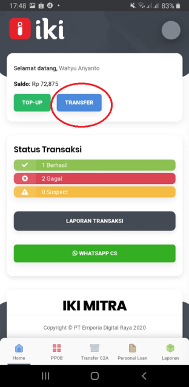
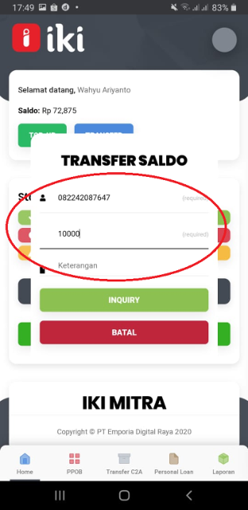
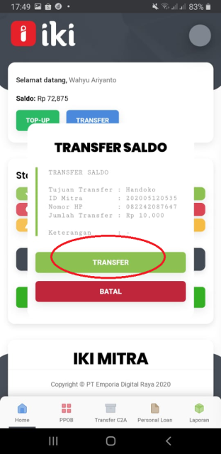
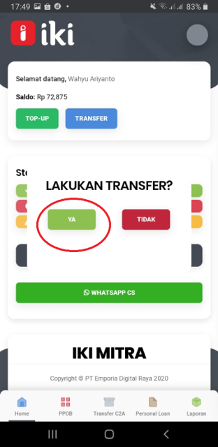
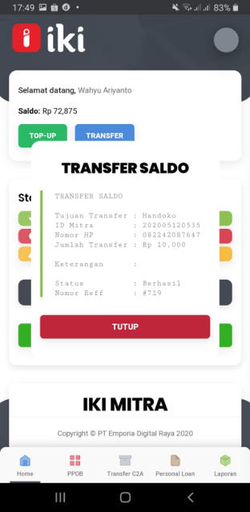

### Buka Aplikasi IKI Mitra, kemudian tekan Transfer

### Tuliskan Nomor HP Tujuan, Jumlah Transfer dan Keterangan

### Tekan INQUIRY , kemudian akan terlihat Tujuan Transfer , ID Mitra , No HP dan nominal transfer 

### Tekan Transfer, kemudian akan muncul notifikasi "Lakukan Transfer"

### Tekan Ya untuk melakukan transfer

### Transaksi Transfer berhasil

